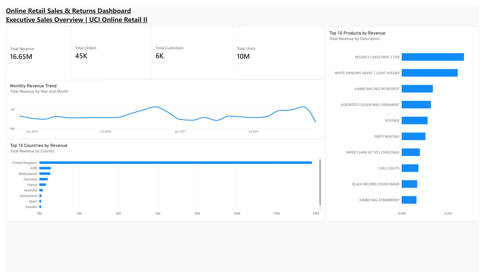
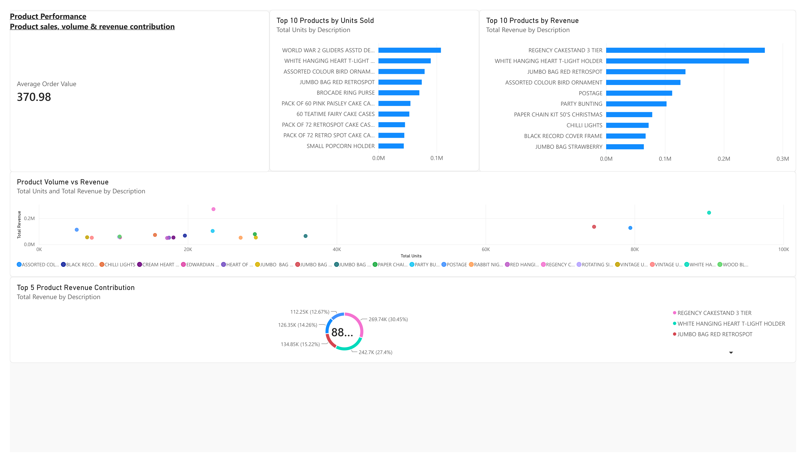
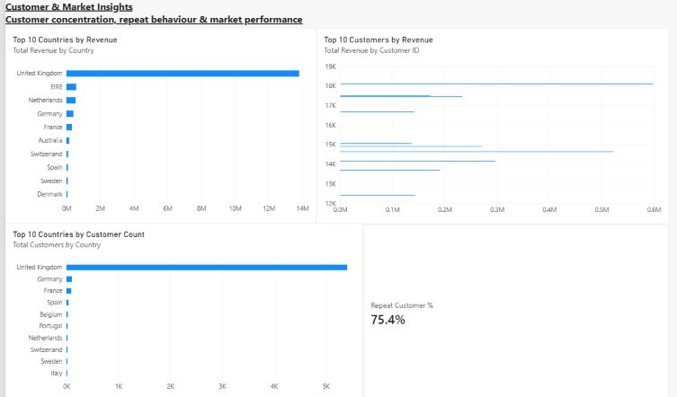
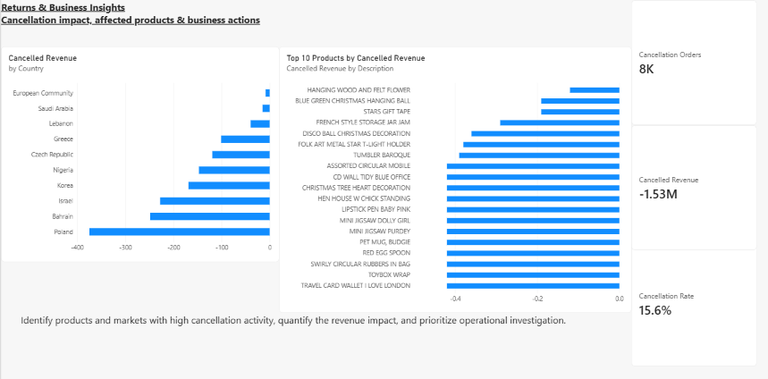

# Online Retail Sales & Returns Dashboard

##  Project Overview

An end-to-end Business Analytics project using Power BI to analyse online retail sales, product performance, customer behaviour, and cancellation activity.

The project uses the UCI Online Retail II dataset, containing approximately 1 million retail transaction records from a UK-based online retailer across two years.

The objective was to transform raw transaction data into an interactive dashboard that supports business-focused analysis and decision-making.

---

##  Business Questions

This project answers the following questions:

- How is revenue changing over time?
- Which countries generate the highest revenue?
- Which products generate the highest revenue?
- Which products have the highest sales volume?
- Which products combine high volume with high revenue?
- How concentrated are customers and revenue across markets?
- What proportion of customers are repeat customers?
- Which countries have the largest customer base?
- How significant are cancellations?
- Which products and countries contribute most to cancellation activity?

---

##  Tools & Technologies

- Power BI
- Power Query
- DAX
- Data Cleaning & Transformation
- Data Visualization
- Business Analytics

---

##  Data Preparation

The raw UCI Online Retail II data was prepared in Power Query before analysis.

Key steps included:

- Combining the two yearly datasets
- Standardizing data types
- Creating a transaction date field
- Separating valid sales transactions from cancellations
- Removing records with missing customer IDs from the sales analysis
- Creating revenue calculations
- Preparing the data model for Power BI analysis

---

##  Dashboard Pages

### 1. Executive Overview

Provides a high-level view of:

- Total Revenue
- Total Orders
- Total Customers
- Total Units
- Monthly Revenue Trend
- Top 10 Countries by Revenue
- Top 10 Products by Revenue

### 2. Product Performance

Analyses:

- Average Order Value
- Top 10 Products by Units Sold
- Top 10 Products by Revenue
- Product Volume vs Revenue
- Top 5 Product Revenue Contribution

### 3. Customer & Market Insights

Focuses on:

- Top 10 Countries by Revenue
- Top 10 Customers by Revenue
- Repeat Customer %
- Top 10 Countries by Customer Count

### 4. Returns & Business Insights

Examines:

- Cancellation Orders
- Cancellation Rate
- Cancelled Revenue
- Top 10 Products by Cancelled Revenue
- Cancelled Revenue by Country

---

##  Key Dashboard Metrics

The completed dashboard shows approximately:

- **£16.65M Total Revenue**
- **45K Orders**
- **6K Customers**
- **10M Units**
- **£370.98 Average Order Value**
- **75.4% Repeat Customer Rate**
- **8K Cancellation Orders**
- **15.6% Cancellation Rate**
- **£1.53M Cancellation Revenue Impact**

---

##  Business Value

The dashboard helps decision-makers:

- Identify high-performing products and markets
- Understand revenue concentration
- Evaluate customer retention behaviour
- Identify products with high sales volume
- Compare product volume against revenue generation
- Quantify cancellation activity
- Prioritize products and markets for operational investigation

---

##  Dashboard Preview

### Executive Overview

### Product Performance

### Customer & Market Insights

### Returns & Business Insights

---

##  Project Files

- `Online_Retail_Sales_Returns_Dashboard.pbix` — Power BI dashboard
- `executive_overview.png` — Executive dashboard screenshot
- `product_performance.png` — Product analysis screenshot
- `customer_market_insights.png` — Customer and market analysis screenshot
- `returns_business_insights.png` — Cancellation analysis screenshot

---

##  Dataset

**UCI Online Retail II Dataset**

Chen, D. (2012). Online Retail II. UCI Machine Learning Repository.

The dataset contains transactions from a UK-based online retailer between December 2009 and December 2011.

Dataset source:

https://archive.ics.uci.edu/dataset/502/online%2Bretail

---

##  Limitations

- The analysis is based on historical transaction data.
- The dataset represents a specific online retailer and may not generalize to all retail businesses.
- Cancellation activity is analysed from transaction records and does not explain the underlying operational reason for each cancellation.
- Customer IDs with missing values were excluded from customer-level analysis.
- Cancellation measures use the full transaction table, including transactions without a Customer ID; sales and order measures use identified-customer transactions only.

---

##  Author

**Monisha Gowda**

MSc Business Analytics & Consultancy  
Business Analytics | Data Analysis | Power BI | SQL | Excel
